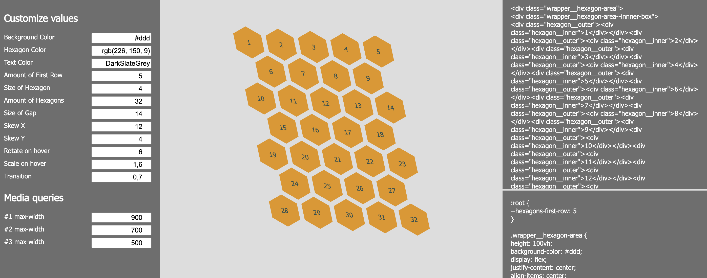

# Hexagon Generator

## What is this?

This is the TypeScript version of this [tool](https://github.com/willemverbuyst/hexagon-generator) (written with vanilla js).

The Hexagon Generator is a tool to create the HTML and CSS needed to display a responsive grid of hexagons.

A live version of the tool can be found here: https://willemverbuyst.github.io/hexagon-generator/

## Why use this?

Setting a up a grid of hexagons with only HTML/CSS can be a challenging job. With this tool the user doesn't have to deal with the mathematical calculation that goes hand in hand with geometrical shapes.

When you want to make the grid responsive the CSS' **flexbox** and **nth-child selectors** combo is a nice but tough solution. This combo is exactly what this tool is based upon. The JavaScript in the background is used to generate the code - not the grid setup.

## How to use this?

Tweak the values in the left pane. The display of the hexagon grid is updated live, as well as the HTML and CSS code. It is just a matter of copying the code in your project. You can replace the numbers with pictures, text, logos etc.

## Installing?

You don't need to install anything. It is HTML and CSS only.

## Tweaking of the values

- **Background Color** can be hexadecimal, rgb or a string value.
- **Hexagon Color** can be hexadecimal, rgb or a string value.
- **Text Color** can be hexadecimal, rgb or a string value.
- **Amount First Row** is the amount of hexagons on the first row.
- **Size of Hexagon** is a value in rem.
- **Amount of Hexagons** is the total amount.
- **Size of Gap** is a percentage. The displayed hexagon is actually an inner hexagon (100% - size of Gap). The gap is created with an transparant outer hexagon.
- **Skew X** is an angle in degrees.
- **Skew Y** is an angle in degrees.
- **Rotate** is an angle in degrees the hexagon will turn when hovered over.
- **Scale** increase/decrease (step 0.1).
- **Transition** is in seconds.

## Media queries

The user can set 3 breakpoints (values in **pixels**).
The first row will decrease one hexagon per breakpoint. When you start with 5, passing the breakpoint, the first row will consist of 4 hexagons etc. The mediaqueries are automatically removed when there are not enough hexagons left to shift them to the next row.

---

## Notes

Tested in Chrome, Firefox and Safari.

## Project with the Hexagon Generator

Github: https://github.com/willemverbuyst/zucchini-hexagons

https://willemverbuyst.github.io/zucchini-hexagons/
