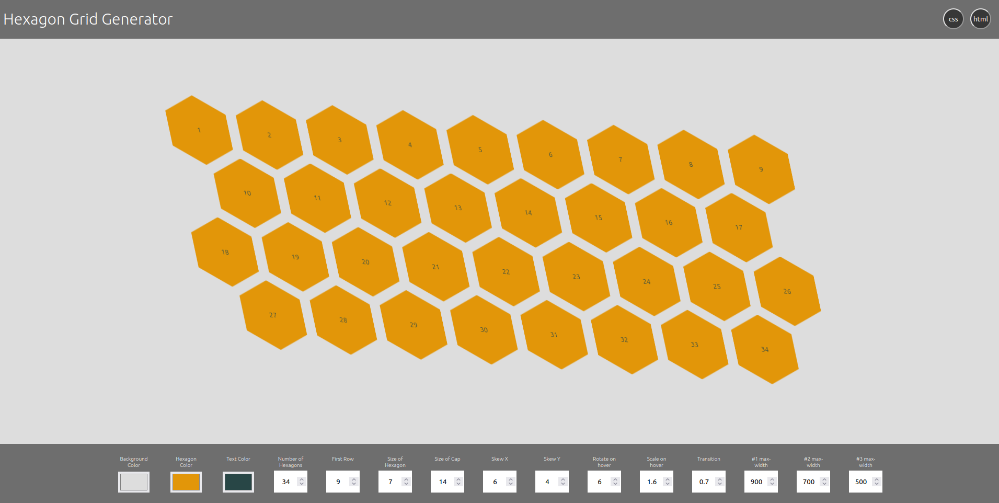

# Hexagon Grid Generator

     

## What is this?

The Hexagon Grid Generator is a tool to create the HTML and CSS needed to display a responsive grid of hexagons.

[live version](https://willemverbuyst.github.io/hexagon-grid-generator/)

## Why use this?

Setting a up a grid of hexagons with only HTML/CSS can be a challenging job. With this tool the user doesn't have to deal with the mathematical calculation that goes hand in hand with geometrical shapes.

When you want to make the grid responsive the CSS' **flexbox** and **nth-child selectors** combo is a nice but tough solution. This combo is exactly what this tool is based upon.

The grid you see is generated with CSS and HTML only. The JavaScript in the background is used to generate the CSS and HTML code for you to copy.

## How to use this?

Tweak the values to your liking. The display of the hexagon grid is updated live, as well as the HTML and CSS code. It is just a matter of copying the code into your project. You can replace the numbers in the HTML with pictures, text, logos etc.

## Installing?

Use the live version and you don't have to install anything. One button to copy the HTM and one to copy the CSS.

When you want to run this tool locally run:

> npm install

## Tweaking of the values

- **Background Color** is a hexadecimal value
- **Hexagon Color** is a hexadecimal value
- **Text Color** is a hexadecimal value
- **Number of Hexagons** is the total number of hexagons
- **First Row** is the number of hexagons on the first row
- **Size of Hexagon** is a value in rem
- **Size of Gap** is a percentage, the displayed hexagon is actually an inner hexagon (100% minus the size of Gap), the gap is created with an transparant outer hexagon (100%)
- **Skew X** is an angle in degrees
- **Skew Y** is an angle in degrees
- **Rotate** is an angle in degrees the hexagon will turn when hovered over
- **Scale** increase/decrease (step 0.1)
- **Transition** is in seconds

## Media queries

The user can set 3 breakpoints (values in **pixels**).
The first row will decrease one hexagon per breakpoint. When you start with 5, passing the breakpoint, the first row will consist of 4 hexagons etc. The mediaqueries are automatically removed when there are not enough hexagons left to shift them to the next row.

---

## Notes

Tested in Chrome, Firefox and Safari.

## Example project with the Hexagon Generator

